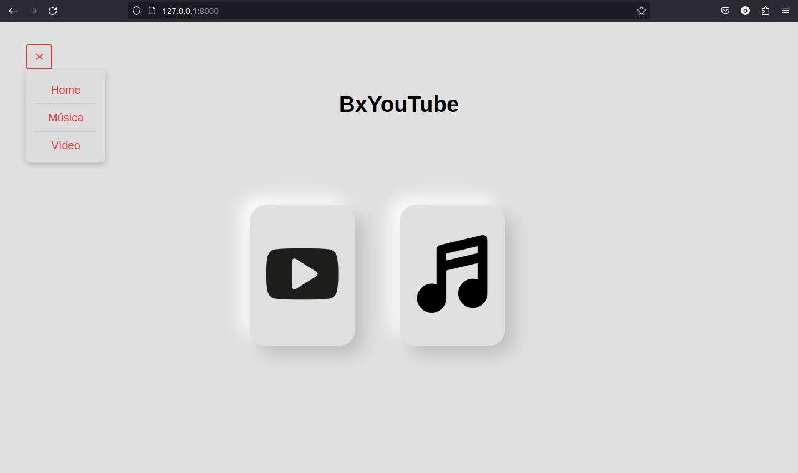
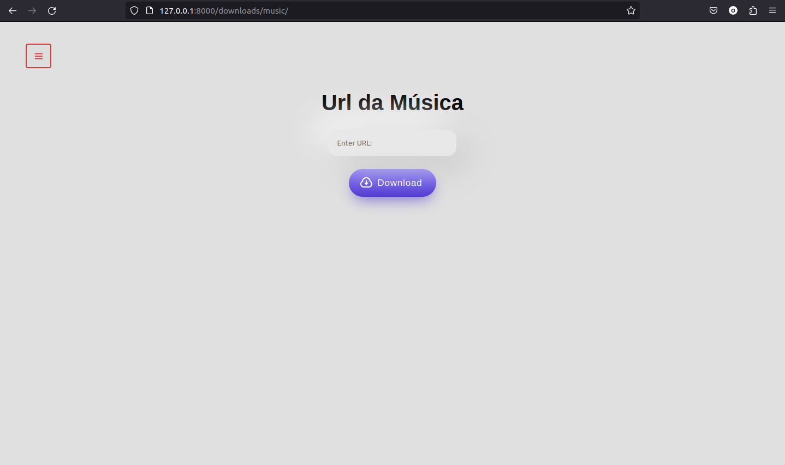

# BxYouTube

Esse Projeto tem o intuito de baixar vídeo e música do YouTube, atraves de uma aplicação Web.


## Imagem de Demonstração





## Licença

[MIT](https://choosealicense.com/licenses/mit/)


## Instalação

Clone o Repositório
```bash
git clone git@github.com:Wenderson-Oscar/Download_YT.git
```


## Variáveis de Ambiente

`Linux`

Crie o ambiente virtual

```bash
virtualenv env
```

Ative o ambiente virtual

```bash
. env/bin/activate
```

## Baixar as dependencias

```bash
pip install -r requirements.txt
```

## Como Utlizar a Aplicação

```bash
python manage.py migrate
python manage.py runserver
```